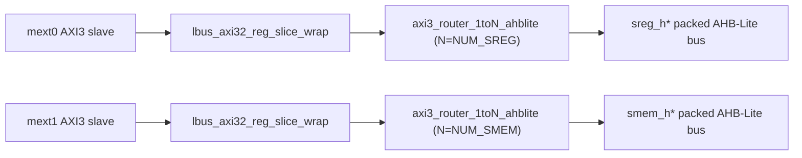

# lbus_plt Module Guide

## General Description
`lbus_plt` is a platform local-bus top that provides two independent AXI3-to-AHB fanout paths.

- Path 0: `mext0` (AXI3 slave, 32-bit) -> register slice -> `NUM_SREG` AHB-Lite ports (`sreg*`)
- Path 1: `mext1` (AXI3 slave, 32-bit) -> register slice -> `NUM_SMEM` AHB-Lite ports (`smem*`)
- `NUM_SREG` and `NUM_SMEM` are independent and can be different.
- Target selection for each AXI transaction is externally provided by one-hot `aw_sel/ar_sel`.

## Mermaid Block Diagram

## Design Assumptions
- `mext0_aw_sel/mext0_ar_sel` are valid one-hot vectors with width `NUM_SREG`.
- `mext1_aw_sel/mext1_ar_sel` are valid one-hot vectors with width `NUM_SMEM`.
- AXI and AHB clocks/resets are common through `aclk` / `aresetn`.
- AHB endpoints correctly return `hready/hresp/hrdata` for each selected slot.
- Protocol legality checks are mostly expected to be guaranteed by the upstream master/system policy.

## Submodule Summary
- `lbus_axi32_reg_slice_wrap` (2 instances)
  - Adds optional per-channel skid/register slicing at `mext0` and `mext1` boundaries.
  - Controlled by `MEXT0_SLICE_EN`, `MEXT1_SLICE_EN`.
- `axi3_router_1toN_ahblite` (2 instances)
  - Routes one AXI slave input to N AHB-Lite outputs.
  - Converts AXI3 transactions to AHB-Lite via internal bridge logic.
  - One instance is configured with `N=NUM_SREG`, the other with `N=NUM_SMEM`.

## Parameter Description
- `NUM_SREG`  
  Number of register-side AHB ports (`sreg` fanout count).
- `NUM_SMEM`  
  Number of memory-side AHB ports (`smem` fanout count).
- `MEXT_ID_WIDTH`  
  AXI ID width for both `mext0` and `mext1`.
- `ADDR_WIDTH`  
  Common AXI/AHB address width.
- `DATA_WIDTH`  
  AXI/AHB data width for both paths (current module uses 32-bit default).
- `HADDR_LOW_BITS`  
  Number of valid low bits kept in AHB address output masking policy.
- `ROUTER_OUTSTANDING`  
  Outstanding ordering/FIFO depth in router path.
- `WR_CMD_DEPTH`, `RD_CMD_DEPTH`, `RESP_DEPTH`  
  Internal AXI-to-AHB bridge queue depths.
- `BUSY_ENABLE`  
  Enables handling/forwarding of AHB BUSY behavior in bridge.
- `MEXT0_SLICE_EN`, `MEXT1_SLICE_EN`  
  Global on/off for all AXI channels in each path's register slice.

## Connection Method
### 1) Basic hookup
- Connect `mext0_*` AXI slave ports and provide `mext0_aw_sel/ar_sel` one-hot target.
- Connect `mext1_*` AXI slave ports and provide `mext1_aw_sel/ar_sel` one-hot target.
- Connect packed AHB buses:
  - `sreg_h*` for register-side targets
  - `smem_h*` for memory-side targets

### 2) Packed AHB indexing
- Slot `i` uses bit slices:
  - `haddr[i*ADDR_WIDTH +: ADDR_WIDTH]`
  - `htrans[i*2 +: 2]`
  - `hsize[i*3 +: 3]`
  - `hburst[i*3 +: 3]`
  - `hprot[i*4 +: 4]`
  - `hwdata[i*DATA_WIDTH +: DATA_WIDTH]`

### 3) Unused-port handling
- Preferred method: reduce `NUM_SREG` / `NUM_SMEM` to the actual used count.
- If fixed top-level width must be kept and some AHB slots are unused:
  - drive `hready=1'b1`, `hresp=1'b0` on unused slave return channels
  - tie `hrdata` to zero on unused slots
  - keep corresponding `aw_sel/ar_sel` bits at `0` so no transaction selects those slots
- If one full AXI path (`mext0` or `mext1`) is intentionally unused:
  - hold its AXI valids low (`awvalid/wvalid/arvalid=0`)
  - tie its selection vectors to zero
  - leave the opposite path fully operational

## Notes
- This module is a **1-to-N distribution** topology for each path, not an N-to-1 merge topology.
- Register slices are inserted before routing/bridge logic to improve timing closure at boundary interfaces.
