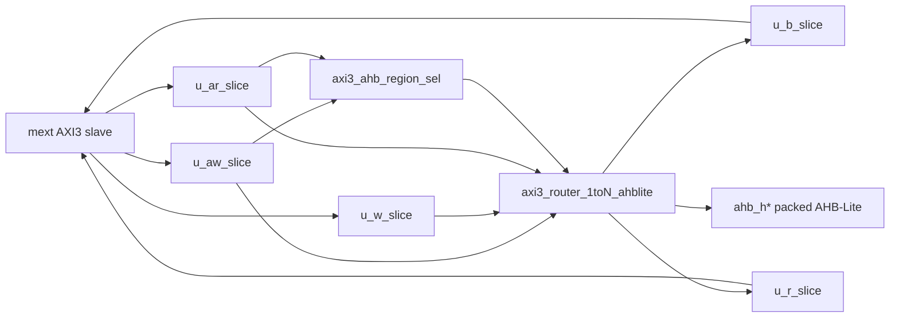

# lbus_plt Module Guide

## General Description
`lbus_plt` is a platform local-bus top with a single AXI3 slave path to multiple AHB-Lite ports.

- `mext` (AXI3 slave, 32-bit) -> per-channel `axi3_reg_slice_ch` -> `axi3_router_1toN_ahblite` -> `NUM_PORTS` AHB-Lite outputs (`ahb_*`)
- AHB target select (`aw_sel` / `ar_sel`) is decoded internally from `mext` AW/AR address via `axi3_ahb_region_sel`.

## Mermaid Block Diagram

## Address Map and Target Decode
Each AHB port owns an equal-sized region. `AHB_REGION_SIZE_KB` sets the slot size in kilobytes (power of two; e.g. `4` = 4KB, `1024` = 1MB).

- Lower `REGION_LSB = $clog2(AHB_REGION_SIZE_KB * 1024)` address bits are passed to the selected AHB target.
- The next `DECODE_W = $clog2(NUM_PORTS)` bits (when `NUM_PORTS > 1`) select the one-hot router target.
- Bits above the decode field are unused; `axi3_ahb_region_sel` zeros them at the input (`addr_map`) before register slices.
- After the slice, `addr_tgt` clears the decode field as well so only `[REGION_LSB-1:0]` reaches the router/AHB bridge.
- The mext base address is assumed aligned to `(region size) × 2^X` where `2^X ≥ NUM_PORTS`.
- Decode codes `≥ NUM_PORTS` map to the **last** port (covers non-power-of-two fanout).

Example: `NUM_PORTS=3`, `AHB_REGION_SIZE_KB=4` (4KB, `REGION_LSB=12`):

| `awaddr[13:12]` | `aw_sel` |
|-----------------|----------|
| `2'b00`         | `3'b001` (port 0) |
| `2'b01`         | `3'b010` (port 1) |
| `2'b10`, `2'b11`| `3'b100` (port 2) |

Decode uses post-slice addresses for `sel`; router `s_*addr` uses `addr_tgt` (target offset only).

## Design Assumptions
- `mext` address map follows the equal-slot layout above; integration must align the mext base accordingly.
- Decoded `aw_sel` / `ar_sel` are one-hot when `mext_awvalid` / `mext_arvalid` (checked in `axi3_router_1toN`).
- Common `aclk` / `aresetn` for AXI and AHB.
- AHB endpoints return `hready` / `hresp` / `hrdata` per slot.
- AHB outputs SINGLE transfers only (`hburst=000`, `htrans=IDLE`/`NONSEQ`).

## Simulation checks and elaboration

| Check | Location | Notes |
|-------|----------|-------|
| mext decoded `aw_sel`/`ar_sel` one-hot | `axi3_router_1toN` | sim-only |
| AHB region decode / `AHB_REGION_SIZE_KB` | `axi3_ahb_region_sel`, `lbus_plt` | elaboration `initial` |
| `NUM_PORTS`, decode field vs `ADDR_WIDTH` | `lbus_plt` | elaboration `initial` |

## Submodule Summary
- `axi3_reg_slice_ch` (5 instances: AW, W, B, AR, R)
  - Optional per-channel register slice at the mext boundary.
  - Controlled by `AW_SLICE_EN`, `W_SLICE_EN`, `B_SLICE_EN`, `AR_SLICE_EN`, `R_SLICE_EN`.
- `axi3_ahb_region_sel` (4 instances: AW/AR input `addr_map`, AW/AR router `sel`+`addr_tgt`)
- `axi3_router_1toN_ahblite` (1 instance, `N=NUM_PORTS`)

## Parameter Description
- `NUM_PORTS` — AHB-Lite fanout count (default 16).
- `MEXT_ID_WIDTH` — AXI ID width.
- `ADDR_WIDTH`, `DATA_WIDTH` — 32-bit default.
- `AHB_REGION_SIZE_KB` — Equal AHB slot size in kilobytes (default 4 = 4KB; must be power of two).
- `ROUTER_OUTSTANDING`, `WR_CMD_DEPTH`, `RD_CMD_DEPTH`, `RESP_DEPTH` — Router/bridge depths.
- `AW_SLICE_EN`, `W_SLICE_EN`, `B_SLICE_EN`, `AR_SLICE_EN`, `R_SLICE_EN` — Per-channel slice enable (0 = comb bypass).

## Connection Method
### Packed AHB indexing
- Slot `i`: `ahb_haddr[i*ADDR_WIDTH +: ADDR_WIDTH]`, etc.

### Migration from v1.0.0 (dual mext0/mext1)
- Replace `mext0_*` / `mext1_*` with single `mext_*`.
- Merge `NUM_SREG` + `NUM_SMEM` into one `NUM_PORTS` router.
- Remove external `mext_aw_sel` / `mext_ar_sel` ports; target select is address-decoded.
- Replace `sreg_h*` / `smem_h*` with `ahb_h*`.
- Replace `MEXT0_SLICE_EN` / `MEXT1_SLICE_EN` with per-channel `AW_SLICE_EN` … `R_SLICE_EN`.

## Notes
- 1-to-N distribution topology; not N-to-1 merge.
- Per-channel `axi3_reg_slice_ch` instances replace the former `lbus_axi32_reg_slice_wrap` module.
