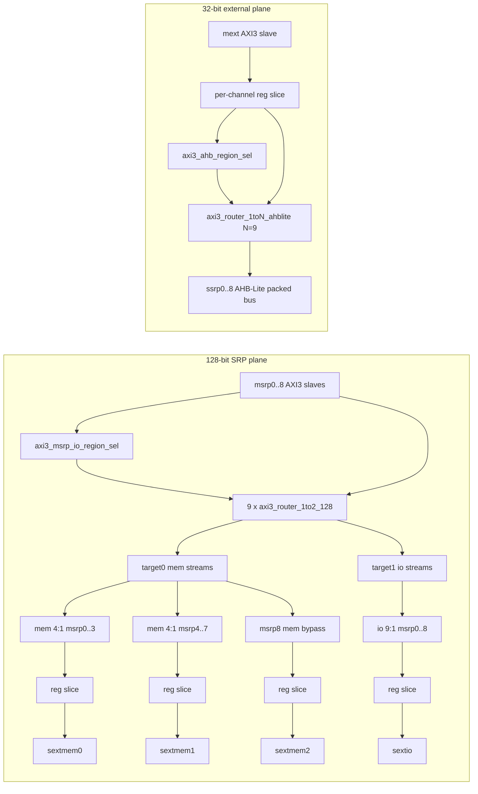

# lbus_srps Module Guide

## General Description
`lbus_srps` is an SRPS local-bus interconnect top with **9 fixed SRP instances** and two major planes:

- **128-bit SRP plane**
  - Inputs: `msrp[0..8]` AXI3 slave ports (packed vectors use `9*`)
  - Per-input routing: each `msrp[i]` passes through `axi3_router_1to2_128`
  - **Target0 (mem path)**, selected by `MSRP_MERGE_CFG`:
    - `msrp[0..7]` → mem N:1 merge → `sextmem[0 .. NUM_MEM_MERGE-1]`
    - `msrp[8]` → mem bypass → `sextmem[SEXTMEM_PORT_NUM-1]`
  - **Target1 (io path):**
    - `msrp[0..8]` → io 9:1 merge → `sextio`
  - `sextmem` / `sextio` outputs are AXI3 masters with register slices.
  - Data width is fixed at **128 bits**; WSTRB is **16 bits**.

- **32-bit external control plane**
  - Input: `mext` AXI3 slave (fixed **32-bit** data, **4-bit** WSTRB)
  - Flow: register slice → address decode → `axi3_router_1toN_ahblite (N=9)` → `ssrp[0..8]` AHB-Lite packed outputs

## Caution — hard-coded msrp address map

**msrp mem/io routing is fixed in RTL**, not provided by external select ports.

| msrp AW/AR address (`ADDR_WIDTH_M`) | Router target | Downstream |
|-------------------------------------|---------------|------------|
| `0xE000_0000` .. `0xFFFF_FFFF` (inclusive) | target1 (`aw_sel`/`ar_sel` = `2'b10`) | `sextio` |
| All other addresses | target0 (`aw_sel`/`ar_sel` = `2'b01`) | `sextmem` |

Decode is implemented in [`axi3_msrp_io_region_sel.v`](axi3_msrp_io_region_sel.v) with **fixed** `IO_ADDR_BASE` / `IO_ADDR_LIMIT` constants (not top-level parameters).

**If the system address map changes, this module must be edited and the design re-verified.** Parent integration cannot retarget mem vs io by tie-off or parameter override alone.

## MSRP_MERGE_CFG Topology (target0 mem path)

| `MSRP_MERGE_CFG` | mem topology | `sextmem` merge ports | msrp[8] bypass port |
|------------------|--------------|------------------------|---------------------|
| 1 | mem 8:1 | `sextmem[0]` | `sextmem[1]` |
| 2 (default) | mem 4:1 × 2 | `sextmem[0]`, `sextmem[1]` | `sextmem[2]` |
| 3 | mem 2:1 × 4 | `sextmem[0..3]` | `sextmem[4]` |

- `SEXTMEM_PORT_NUM = (1 << (MSRP_MERGE_CFG - 1)) + 1` → **2, 3, or 5** ports.
- Mem merge group `mi` connects `rt0[mi*MEM_MERGE_N +: MEM_MERGE_N]`.
- Mem merge and bypass IDs are zero-extended to `SEXTMEM_ID_WIDTH` on the packed `sextmem_*` bus.

## ID Width Summary

Merge modules widen IDs as `{source_tag, original_id}` (tag in MSBs).

| Path | Merge | Source tag | Merge output ID width | Bus parameter |
|------|-------|------------|----------------------|---------------|
| target0 mem | mem 8:1 (CFG=1) | 3 (`MEM_MERGE_TAG_W`) | `MSRP_ID_WIDTH + 3` | `SEXTMEM_ID_WIDTH` |
| target0 mem | mem 4:1 (CFG=2) | 2 | `MSRP_ID_WIDTH + 2` | `SEXTMEM_ID_WIDTH` |
| target0 mem | mem 2:1 (CFG=3) | 1 | `MSRP_ID_WIDTH + 1` | `SEXTMEM_ID_WIDTH` |
| target0 mem | msrp[8] bypass | none | `MSRP_ID_WIDTH` | zero-pad to `SEXTMEM_ID_WIDTH` |
| target1 io | io 9:1 | 4 (`IO_MERGE_TAG_W`) | `MSRP_ID_WIDTH + 4` | `SEXTIO_ID_WIDTH` |

Default `SEXTMEM_ID_WIDTH` matches the active CFG minimum (no MSB pad on mem merge output).  
Bypass port pads `MSRP_ID_WIDTH` → `SEXTMEM_ID_WIDTH` by `MEM_MERGE_TAG_W` zero bits (same as tag width for that CFG).

## Mermaid Block Diagram (default CFG=2)

## Design Assumptions
- `msrp` target select (mem vs io) is decoded from each port's AW/AR address (see **Caution** above).
- `mext` AHB target select is decoded from `mext` AW/AR address (equal slot size `AHB_REGION_SIZE_KB`; see `lbus_plt.md` decode rules). Unused address bits are zeroed at input and before the router.
- All interfaces share `aclk` and active-low `aresetn`.
- AXI protocol legality and address-map correctness are guaranteed by system integration policy.
- Do not interleave write/read IDs on `mext` for a given outstanding transaction class.
- Each `msrp` port does not interleave W beats (master contract); `axi3_aw_w_order_gate` enforces AW-before-W per port.
- `axi3_merge_Nto1_128` uses RR on AW/AR; **W follows AW acceptance order** via an internal ordering FIFO (`WR_OUTSTANDING_DEPTH`, default tied to `MSRP_WR_PENDING_DEPTH`). Multiple ports in one merge group may write concurrently without SW serialization.
- AW and AR target decode are independent per port; software should keep mem/io address usage consistent (split AW/AR targets do not cause interconnect deadlock, but can cause functional errors if misused).
- Each `msrp` port includes `axi3_aw_w_order_gate`: W gated until AW handshake; **AW backpressured** when pending reaches `MSRP_WR_PENDING_DEPTH`.
- `mext` AW-before-W ordering is enforced inside `axi3_router_1toN` via the write
  ordering FIFO (`w_fifo_empty` gates `s_wready`); no separate gate on `mext`.
- `ssrp` AHB outputs SINGLE transfers only (`hburst=000`, `htrans=IDLE`/`NONSEQ`).

## AW-before-W enforcement

| Path | Mechanism | Module |
|------|-----------|--------|
| msrp per port | Pending counter gates W; AW backpressure at depth | `axi3_aw_w_order_gate` (9×) |
| msrp merge → sextmem/sextio | W ordering FIFO (AW push / WLAST pop) | `axi3_merge_Nto1_128` |
| mext → ssrp | Write ordering FIFO; `s_wready=0` while `w_fifo_empty` | `axi3_router_1toN` |

## Simulation checks and elaboration (no duplicate coverage)

| Check | Location | Notes |
|-------|----------|-------|
| msrp decoded `aw_sel`/`ar_sel` one-hot (2-bit) | `axi3_router_1to2_128` | sim-only (`translate_off`) |
| mext decoded `aw_sel`/`ar_sel` one-hot | `axi3_router_1toN` | sim-only (existing) |
| mext W without AW / WID vs front AWID | `axi3_router_1toN_ahblite` | sim monitor (existing) |
| mext R without AR / RID vs front ARID | `axi3_router_1toN_ahblite` | sim monitor (existing) |
| msrp gate pending overflow / WLAST with zero pending | `axi3_aw_w_order_gate` | sim-only |
| merge W without AW in ordering FIFO / AW at FIFO full | `axi3_merge_Nto1_128` | sim-only |
| AHB bridge W/AW protocol | `axi3_to_ahblite` | sim-only (existing) |
| Parameter consistency (CFG, ID width, bypass/merge pad, pending depth, IO tag width) | `lbus_srps` | elaboration `initial` |
| AHB region decode field vs ADDR_WIDTH | `axi3_ahb_region_sel` | elaboration `initial` |

## Submodule Summary
- `axi3_aw_w_order_gate` (9 instances)
  - Per `msrp` input: `awready_o = awready_i && !pending_full`; W gated until pending (AW accepted).
- `axi3_msrp_io_region_sel` (18 instances: AW + AR per `msrp` port)
  - Hard-coded mem/io split; see **Caution** section.
- `axi3_router_1to2_128` (9 instances)
  - Per `msrp` input, routes transaction to target0 (mem) or target1 (io).
  - Sim-only one-hot check on `aw_sel`/`ar_sel` when valid.
- `axi3_merge_Nto1_128` (`NUM_MEM_MERGE` + 1 instances)
  - `NUM_MEM_MERGE` mem merge blocks on target0 (N = 8, 4, or 2 per CFG).
  - One io 9:1 merge on target1 for `sextio`.
  - AW/AR RR; W serialized by AW-acceptance FIFO (`WR_OUTSTANDING_DEPTH`).
- `lbus_axi128_reg_slice_wrap` (`SEXTMEM_PORT_NUM` + 1 instances)
  - Boundary timing isolation for each `sextmem[i]` and `sextio`.
- `axi3_reg_slice_ch` (5 instances on `mext`: AW, W, B, AR, R)
- `axi3_ahb_region_sel` (4 instances on `mext`: AW/AR input `addr_map`, AW/AR router `sel`+`addr_tgt`)
- `axi3_router_1toN_ahblite` (1 instance, `N=9`)

## Parameter Description
- `MSRP_MERGE_CFG` (default 2)
  - Selects target0 mem merge geometry: 1=mem 8:1, 2=mem 4:1×2, 3=mem 2:1×4.
- `SEXTMEM_PORT_NUM` (default derived from CFG)
  - Number of packed `sextmem` master ports. Must equal `(1 << (MSRP_MERGE_CFG-1)) + 1`.
- `MSRP_ID_WIDTH` (default 5)
  - AXI ID width of each `msrp` slave port.
- `IO_MERGE_TAG_W` (default 4)
  - Source index width for io 9:1 merge (9 SRP ports → 4 bits).
- `SEXTMEM_ID_WIDTH` (default CFG-derived)
  - CFG=1: `MSRP_ID_WIDTH + 3`; CFG=2: `+ 2`; CFG=3: `+ 1`.
  - Packed `sextmem_*` bus width; may be overridden wider (MSB zero-pad on mem merge).
- `SEXTIO_ID_WIDTH` (default `MSRP_ID_WIDTH + IO_MERGE_TAG_W`)
  - AXI ID width on `sextio` after io 9:1 merge.
- `MEXT_ID_WIDTH` — AXI ID width of `mext`.
- `ADDR_WIDTH_M` — address width on `msrp` / `sextmem` / `sextio`.
- `ADDR_WIDTH_S` — address width on `mext` / `ssrp`.
- `AHB_REGION_SIZE_KB` — equal `ssrp` AHB slot size in kilobytes (default 4 = 4KB; power of two).
- `ROUTER_OUTSTANDING`, `WR_CMD_DEPTH`, `RD_CMD_DEPTH`, `RESP_DEPTH` — bridge/router tuning on the `mext`/`ssrp` path.
- `MSRP_WR_PENDING_DEPTH` (default 16) — max outstanding AW-before-W slots per `msrp` port; also drives merge `WR_OUTSTANDING_DEPTH`.
- `SEXT_*_SLICE_EN`, `MEXT_*_SLICE_EN` — per-channel register slice enables.

### Fixed topology (not parameters)
- SRP count: **9** (`msrp`/`ssrp` valid/ready are `[8:0]`; packed buses use `9*`).
- `msrp` / `sext*`: 128-bit data, 16-bit WSTRB.
- `mext` / `ssrp`: 32-bit data, 4-bit WSTRB.

## Connection Method

### 1) msrp interface mapping
- Index `i` = SRP / `msrp<i>` (`i` = 0 .. 8).
- Connect each `msrp` port into packed slices (`[i*W +: W]` style).
- No external `msrp_aw_sel` / `msrp_ar_sel` ports; target is decoded from `msrp_awaddr` / `msrp_araddr` per the **Caution** table (`2'b01` = sextmem, `2'b10` = sextio).

### 2) sextmem packed outputs
- Port `p` uses slice `[p*W +: W]` on each packed bus.
- Mem merge ports `p = 0 .. NUM_MEM_MERGE-1`: ID width `MSRP_ID_WIDTH + MEM_MERGE_TAG_W`.
- Bypass port `p = SEXTMEM_PORT_NUM - 1`: ID width `MSRP_ID_WIDTH`, zero-padded to `SEXTMEM_ID_WIDTH`.

### 3) sextio
- Single AXI3 master after io 9:1 merge; IDs are `SEXTIO_ID_WIDTH` wide.

### 4) mext -> ssrp AHB mapping
- `mext` is a standard AXI3 slave interface (no external `aw_sel` / `ar_sel` ports).
- `axi3_ahb_region_sel` decodes `mext_rt_awaddr` / `mext_rt_araddr` into one-hot router select; `mext_rt_*addr_tgt` (region offset only) drives router `s_*addr`.
- Slot size and decode field layout match `lbus_plt` (`AHB_REGION_SIZE_KB`, last port absorbs unused decode codes).
- `ssrp_h*` are packed buses with index `i` corresponding to SRP `i`.

### 5) Unused-port handling
- **Unused msrp input**: hold valids low; tie `bready/rready` as needed.
- **Unused sextmem port**: connect a benign AXI sink or stub that accepts transactions.
- **Unused ssrp slot**: return `hready=1`, `hresp=0`, `hrdata=0`; avoid routing mext traffic to that slot via address map.
- **Unused mext path**: keep valids low.

## Migration Notes

### Port naming (flat → packed)
| Old (flat) | New (packed / renamed) |
|------------|-------------------------|
| `sextmem0_*`, `sextmem1_*`, `sextmem2_*` | `sextmem_*[(p*W)+:W]` per CFG table |
| `sextio0_*` | `sextio_*` |
| `mext0_*` | `mext_*` |

### SEXTMEM_ID_WIDTH default change
Previously default was always `MSRP_ID_WIDTH + 3` (CFG=1 worst case).  
Now default tracks active CFG:

| CFG | Old default | New default |
|-----|-------------|-------------|
| 1 | MSRP+3 | MSRP+3 (unchanged) |
| 2 | MSRP+3 | MSRP+2 |
| 3 | MSRP+3 | MSRP+1 |

Re-check packed `sextmem_*id` slice width on the parent module when using CFG=2 or 3.

## Notes
- Elaboration checks (simulation only) verify `MSRP_MERGE_CFG`, `SEXTMEM_PORT_NUM`, and minimum ID widths.
- `msrp[8]` target0 path is always mem bypass (no merge), so latency/ID behavior differs from mem merge ports.
- **Caution:** mem/io address boundaries are RTL constants in `axi3_msrp_io_region_sel.v`; update that file when the platform map changes.
