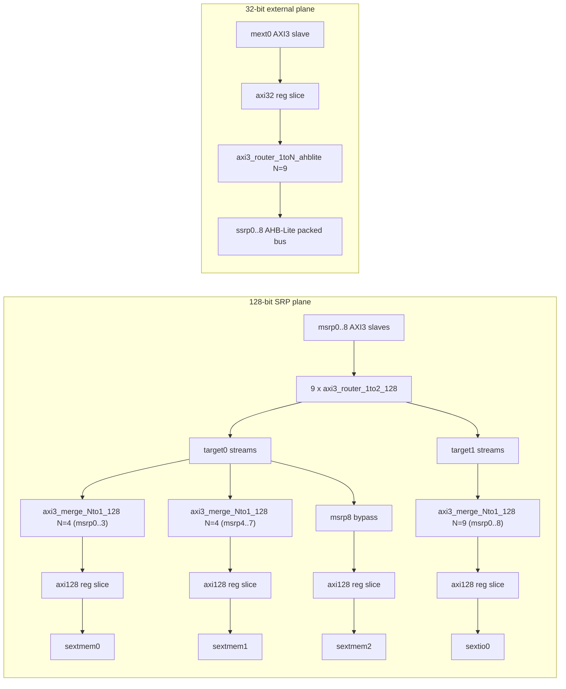

# lbus_srps Module Guide

## General Description
`lbus_srps` is an SRPS local-bus interconnect top with two major planes:

- **128-bit SRP plane**
  - Inputs: `msrp0..8` AXI3 slave ports (packed as vectors)
  - Per-input routing: each `msrp[i]` passes through `axi3_router_1to2_128`
  - Target-0 branch:  
    - `msrp0..3` -> merge4 -> `sextmem0`  
    - `msrp4..7` -> merge4 -> `sextmem1`  
    - `msrp8` -> bypass -> `sextmem2`
  - Target-1 branch:
    - `msrp0..8` -> merge9 -> `sextio0`
  - `sext*` outputs are AXI3 masters with register slices.

- **32-bit external control plane**
  - Input: `mext0` AXI3 slave
  - Flow: register slice -> `axi3_router_1toN_ahblite (N=9)` -> `ssrp0..8` AHB-Lite packed outputs

## Mermaid Block Diagram

## Design Assumptions
- `msrp_aw_sel` and `msrp_ar_sel` are externally generated per `msrp` port and each is one-hot on 2 targets.
- `mext0_aw_sel` and `mext0_ar_sel` are one-hot on 9 AHB targets.
- All interfaces share `aclk` and active-low `aresetn`.
- AXI protocol legality and address-map correctness are guaranteed by system integration policy.
- `sextmem0/1` and `sextio0` accept widened AXI IDs created by merge modules.

## Submodule Summary
- `axi3_router_1to2_128` (9 instances)
  - Per `msrp` input, routes transaction to target0 or target1.
  - Keeps ordering/routing consistency for each input stream.
- `axi3_merge_Nto1_128` (3 instances)
  - Merge4 for `sextmem0`, Merge4 for `sextmem1`, Merge9 for `sextio0`.
  - Widen output ID as `{source_index, original_id}` to demux responses.
- `lbus_axi128_reg_slice_wrap` (4 instances)
  - Boundary timing isolation for `sextmem0/1/2` and `sextio0`.
- `lbus_axi32_reg_slice_wrap` (1 instance)
  - Boundary timing isolation for `mext0`.
- `axi3_router_1toN_ahblite` (1 instance, `N=9`)
  - Routes `mext0` traffic to `ssrp0..8` and performs AXI3->AHB-Lite bridging.

## Parameter Description
- `MSR_ID_WIDTH`  
  AXI ID width of `msrp` inputs.
- `MEXT_ID_WIDTH`  
  AXI ID width of `mext0`.
- `ADDR_WIDTH`  
  Common address width.
- `DATA_WIDTH_128`  
  Data width for `msrp`/`sext*` AXI interfaces.
- `DATA_WIDTH_32`  
  Data width for `mext0`/`ssrp` path.
- `HADDR_LOW_BITS`  
  AHB address output mask-width option in AHB router/bridge path.
- `ROUTER_OUTSTANDING`  
  Outstanding depth for `mext0` router path.
- `WR_CMD_DEPTH`, `RD_CMD_DEPTH`, `RESP_DEPTH`  
  Queue depth settings in AXI-to-AHB bridge path.
- `BUSY_ENABLE`  
  Enable AHB BUSY handling in bridge logic.
- `SEXT_SLICE_EN`  
  Enable/disable all channels of 128-bit output boundary slices.
- `MEXT_SLICE_EN`  
  Enable/disable all channels of `mext0` boundary slice.

## Connection Method
### 1) msrp interface mapping
- Packed vectors correspond to index `i` = `msrp<i>`.
- Connect each `msrp` port into packed slices (`[i*W +: W]` style).
- For each `msrp<i>`, provide:
  - `msrp_aw_sel[(i*2)+:2]`
  - `msrp_ar_sel[(i*2)+:2]`
  where bit0=target0(mem path), bit1=target1(io path).

### 2) sext* outputs
- `sextmem0`/`sextmem1` IDs use width `MSR_ID_WIDTH + 2` (merge4 source-tag).
- `sextio0` IDs use width `MSR_ID_WIDTH + 4` (merge9 source-tag).
- `sextmem2` is bypass from `msrp8` target0 branch and keeps original `MSR_ID_WIDTH`.

### 3) mext0 -> ssrp AHB mapping
- `mext0` is a standard AXI3 slave interface.
- `mext0_aw_sel/ar_sel` choose one of 9 `ssrp` AHB slots.
- `ssrp_h*` are packed buses with index `i` corresponding to `ssrp<i>`.

### 4) Unused-port handling
- **Unused msrp input (`msrp<i>`)**:
  - hold `awvalid/wvalid/arvalid` low for that index
  - tie `bready/rready` to safe constant (typically `1`) if desired
  - drive `aw_sel/ar_sel` for that index to `2'b00`
- **Unused sext output (`sextmem*` or `sextio0`)**:
  - keep `*_awready`, `*_wready`, `*_arready` low only if you intentionally stall upstream traffic
  - safer default for "logically unused but must not stall": accept and return OKAY-like responses in a sink/stub endpoint
- **Unused ssrp AHB slot (`ssrp<i>`)**:
  - return `hready=1'b1`, `hresp=1'b0`, `hrdata='0` for that slot
  - ensure `mext0_aw_sel/ar_sel` does not target unused slots
- **Completely unused mext0 path**:
  - keep `mext0_awvalid/wvalid/arvalid=0`, selection vectors zero
  - tie remaining control inputs to benign constants

## Notes
- ID width differs by destination (`sextmem0/1`, `sextio0`, `sextmem2`) due to merge source tagging.
- `msrp8` target0 path is intentionally bypassed (no merge), so latency/ID behavior differs from `sextmem0/1` paths.
